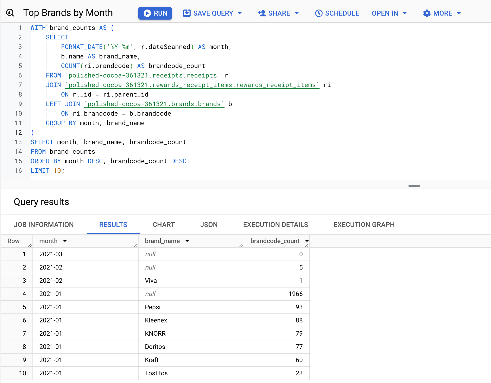
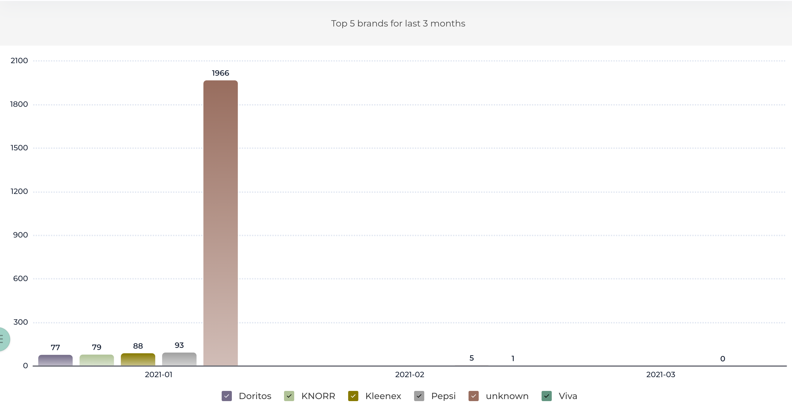
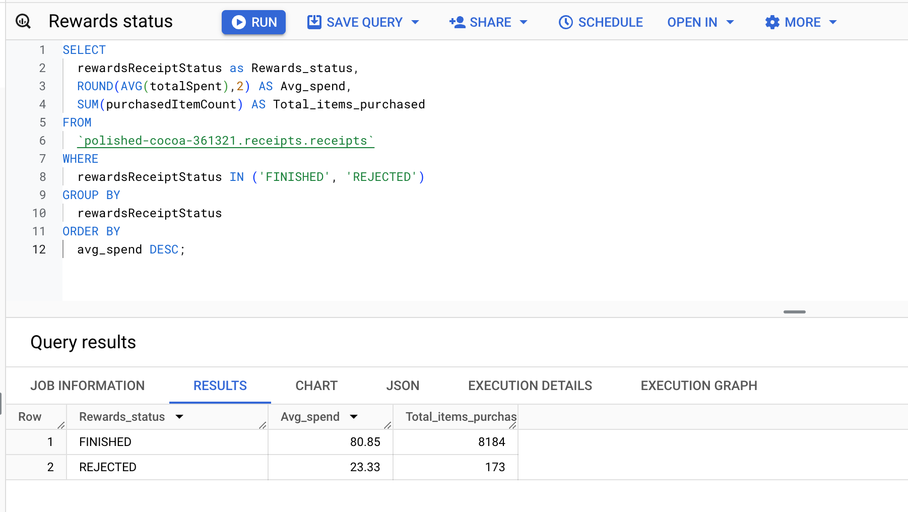
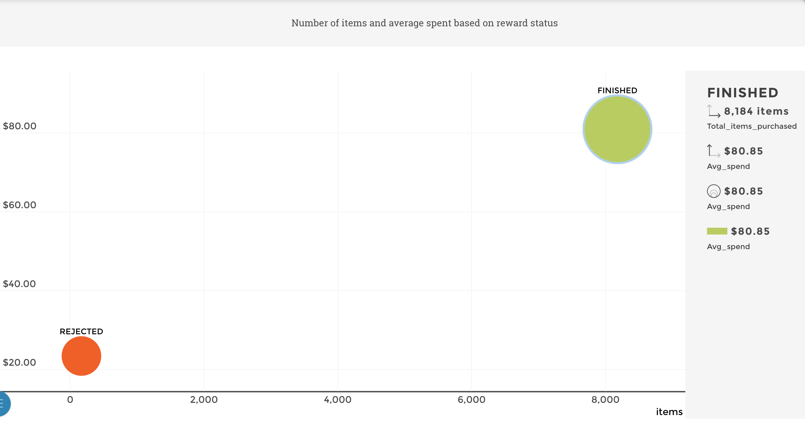

What are the top 5 brands by receipts scanned for most recent month?
How does the ranking of the top 5 brands by receipts scanned for the recent month compare to the ranking for the previous month?



SQL code: 
```sql
WITH brand_counts AS (
    SELECT 
        FORMAT_DATE('%Y-%m', r.dateScanned) AS month,
        b.name AS brand_name,
        COUNT(ri.brandcode) AS brandcode_count
    FROM `polished-cocoa-361321.receipts.receipts` r
    JOIN `polished-cocoa-361321.rewards_receipt_items.rewards_receipt_items` ri
        ON r._id = ri.parent_id
    LEFT JOIN `polished-cocoa-361321.brands.brands` b
        ON ri.brandcode = b.brandcode
    GROUP BY month, brand_name
)
SELECT month, brand_name, brandcode_count
FROM brand_counts
ORDER BY month DESC, brandcode_count DESC
LIMIT 10;
``` 

There are no top brands in March since no data is available for that month, and the ranking of the top 5 brands for February only includes Viva as the single listed brand. The ranking has significantly decreased in the most recent month (March), likely due to the absence of data.



When considering average spend from receipts with 'rewardsReceiptStatus’ of ‘Accepted’ or ‘Rejected’, which is greater?
When considering total number of items purchased from receipts with 'rewardsReceiptStatus’ of ‘Accepted’ or ‘Rejected’, which is greater?



SQL code: 
```sql
SELECT 
  rewardsReceiptStatus as Rewards_status,
  ROUND(AVG(totalSpent),2) AS Avg_spend,
  SUM(purchasedItemCount) AS Total_items_purchased
FROM 
  `polished-cocoa-361321.receipts.receipts`
WHERE 
  rewardsReceiptStatus IN ('FINISHED', 'REJECTED')
GROUP BY 
  rewardsReceiptStatus
ORDER BY 
  avg_spend DESC;
```

