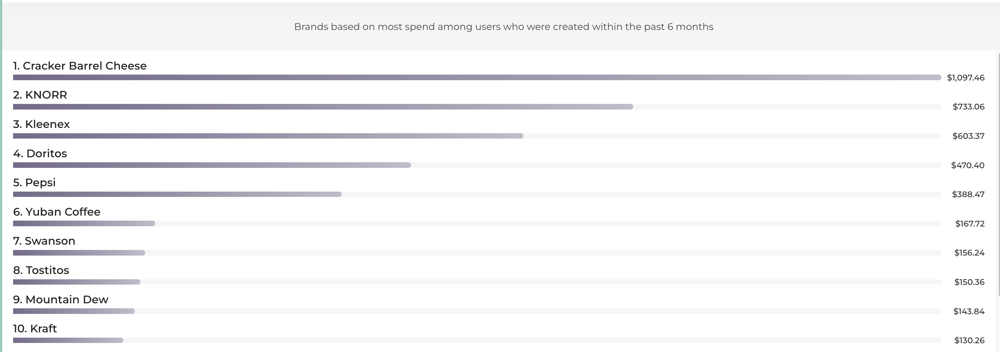
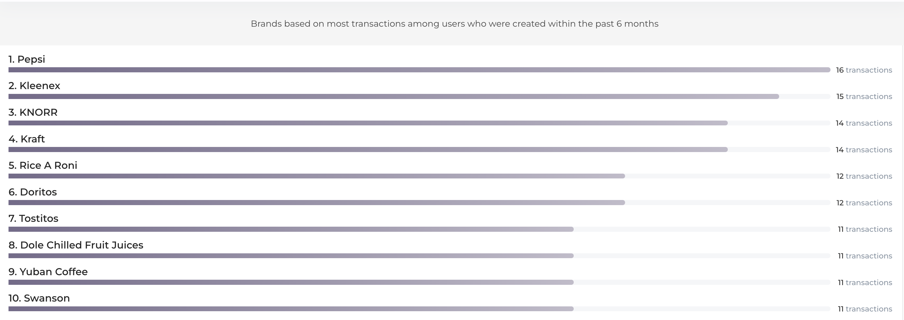

Hi Sam,

I hope this message finds you well. I’ve reviewed the receipt data schema, and while the dataset is in good shape overall, I’ve identified a few opportunities to enhance its quality and optimize its structure for business insights. Below is a summary of key observations and considerations:

- **Users**: There are 283 duplicate values, which is expected given multiple logins. However, the missing SignUpSource entries could indicate gaps in understanding user acquisition channels. Addressing this could provide valuable insights for marketing efforts.
- **Brands**: There are 234 missing brandCode values, which may limit the accuracy of brand trend analysis. Using barcodes as a fallback could mitigate this issue while preserving trend insights.
- **Receipts**: While there are no duplicate rows, missing values in purchasedItemCount and purchaseDate reduce the ability to derive actionable purchasing trends.
  - Additionally, the RewardsReceiptItemList JSON column has missing fields like brandCode, barcode, and item price. These gaps hinder analysis of user spending patterns and brand preferences.

**Questions and Recommendations:**
1. Addressing Missing Values:
   - Would it be possible to fill in missing values by extracting information from other sources or through imputation?
   - If filling the gaps isn’t feasible, would you prefer replacing missing values with placeholder text like “Unknown” for tracking purposes?
   - Prioritizing fields such as brandCode and barcode would be particularly helpful for trend analysis.
 
2. Optimization Suggestions:
    - The RewardsReceiptItemList column could be normalized into a separate table that references the receipts table. This would improve data organization and scalability while simplifying analysis of this vital information.
    - Similarly, CPG could also benefit from being structured as its own table, especially if scaling becomes a priority in this part of the product.

3. Performance and Scaling Concerns:
	•	Normalizing large JSON columns and critical datasets like RewardsReceiptItemList would improve query performance and ensure smoother scaling as data volume grows.
	•	Implementing validation checks in the ETL pipeline could proactively address data quality issues and reduce downstream inefficiencies.

For reference, please see the insights I could gather with the current schema, hope that helps

Please let me know how you’d like to proceed with addressing the missing values and optimizing the schema. I’d be happy to provide more detailed recommendations or prioritize specific areas as needed. I am also open to jump on a quick if it is easier to go over it.

Regards,    
Bibek
